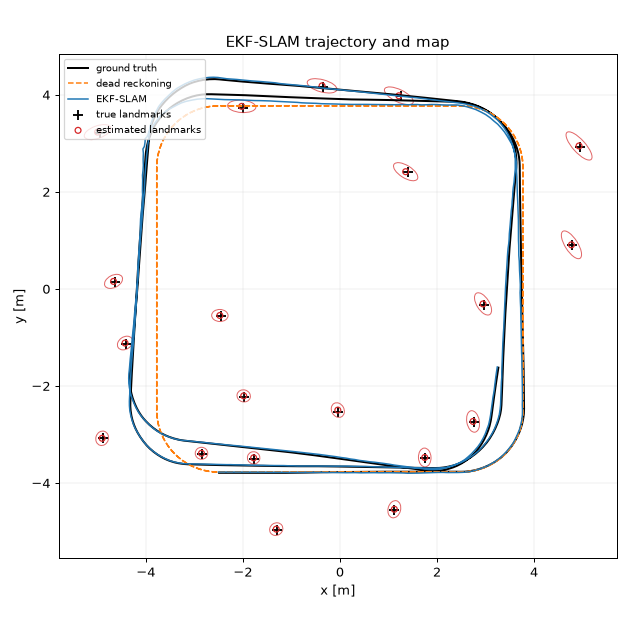
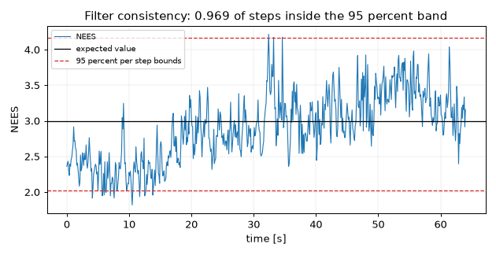

# Differential Drive SLAM

EKF-SLAM with landmark association and occupancy grid mapping for a simulated
differential drive robot, evaluated for consistency rather than only for accuracy.

[](https://github.com/Eelis03/differential-drive-slam/actions/workflows/ci.yml)
[](https://www.python.org/downloads/)
[](LICENSE)



A wheeled robot that integrates its wheel commands alone drifts by 0.51 m RMSE over
the 64 second run above, and the drift grows without limit. Correcting it needs a
map, and building a map needs to know where the robot is, so the two are estimated
together in one Gaussian over the pose and every landmark. This repository is a
small, readable, dependency-light implementation of that, with a simulator that
supplies ground truth so that every claim below is a measurement.

The reason to read the evaluation before the method is that the interesting question
about a filter is not how close it gets, but whether the uncertainty it reports can
be believed. That question is answered first.

## Results

Every block below is the verbatim output of the command above it, produced on
Python 3.12 with numpy 2.5.1, scipy 1.18.0, and matplotlib 3.11.1.

### Is the reported uncertainty believable

`uv run python examples/run_consistency_study.py`

Twenty independent noise realisations over the same map, with the normalised
estimation error squared of the pose averaged across runs at each time step:

```text
runs                         20
steps per run                640
ATE position RMSE mean [m]   0.1140
ATE position RMSE std [m]    0.0708
landmark RMSE mean [m]       0.1048
landmark RMSE std [m]        0.0680
landmarks deleted            12
surplus landmarks remaining  1
ensemble average NEES        2.8969
expected value               3
per step bounds (95 percent) [2.0241, 4.1649]
steps inside per step bounds 0.9688
nominal inside fraction      0.9500
pooled bounds (95 percent)   [2.9577, 3.0425]
verdict on pooled average    conservative
```



The verdict is that the filter is consistent, marginally on the conservative side.

The per-step test is the one that carries the evidence. At each time step the average
of 20 independent NEES values should fall inside [2.0241, 4.1649] with probability
0.95 if the filter is consistent. 96.9 percent of the 641 time steps do, against a
nominal 95 percent, so the reported covariance is not too small anywhere along the
trajectory. The ensemble average over the whole run is 2.8969 against an expected
value of 3, which is 3.4 percent low. The pooled interval [2.9577, 3.0425] places
that just outside, which is where the printed verdict of conservative comes from, but
the pooled interval treats the 640 time samples within a run as independent when they
are strongly correlated, so it is far tighter than the evidence supports and is
printed for completeness rather than used as the test.

Reading both together: the filter reports very slightly more uncertainty than it has,
and nowhere reports less. That is the safe direction of error.

This is not a general statement about EKF-SLAM, which is documented to become
optimistic once the heading uncertainty grows large between loop closures. This
scenario keeps the heading uncertainty near 0.010 rad, so it does not exercise that
regime at all. The conditions under which the verdict should be expected to flip are
set out in [docs/design-notes.md](docs/design-notes.md).

### How well does it localise, and how good is the map

`uv run python examples/run_ekf_slam.py`

```text
steps                        640
true landmarks               20
estimated landmarks          20
ATE position RMSE [m]        0.0541
ATE position max [m]         0.1598
ATE heading RMSE [rad]       0.0101
dead reckoning RMSE [m]      0.5146
dead reckoning max [m]       1.0021
landmark position RMSE [m]   0.0275
landmark position max [m]    0.0498
measurements                 4040
matched                      3976
initialised                  20
rejected as ambiguous        44
deleted by map management    0
incorrect matches            0
association accuracy         1.0000
time averaged NEES           1.0708
expected value               3
per step bounds (95 percent) [0.2158, 9.3484]
steps inside per step bounds 0.7941
nominal inside fraction      0.9500
pooled bounds (95 percent)   [2.8133, 3.1926]
verdict on pooled average    conservative
```

On this seed the filter cuts the trajectory error by a factor of 9.5 against dead
reckoning, recovers all 20 landmarks with no duplicates, and makes no incorrect
association across 4040 detections. The 44 detections it discards as ambiguous are
1.1 percent of the total.

This seed is a favourable draw and should be read as an illustration, not as the
headline. Its trajectory error of 0.054 m is less than half the 0.114 m mean of the
20-run ensemble above, and its time averaged NEES of 1.07 is far below the ensemble
figure of 2.90 because a single 640-step run is nowhere near 640 independent samples.
The ensemble numbers are the ones that carry information.

### Can the correspondences be recovered from the measurements alone

`uv run python examples/run_data_association.py`

Five noise realisations, each run three ways: once with the true correspondences
handed to the filter, once with them recovered by the maximum likelihood policy, and
once more with the policy but with landmark deletion switched off.

```text
steps per run                640
seeds                        5
association             ATE RMSE [m]   landmark RMSE [m]   landmarks  incorrect
known correspondence          0.1013              0.0937        20.0          0
maximum likelihood            0.1007              0.0946        20.0          0
the same, no deletion         0.1007              0.1052        20.4          0
measurements (ML runs)       20407
rejected as ambiguous        190
rejection rate               0.0093
landmarks deleted            3
surplus landmarks without it 2
```

Across 20407 detections the policy makes no incorrect assignment. The gap in
trajectory error between known and recovered correspondences, 0.1013 m against
0.1007 m, is two orders of magnitude smaller than the run to run standard deviation
of 0.0708 m reported by the consistency study, so on this scenario solving the
association problem from the measurements alone costs nothing measurable in
localisation accuracy. It costs 0.93 percent of the detections, which are discarded
as too ambiguous to use.

The third row is what landmark deletion is worth. Without it the policy ends with
20.4 landmarks against a true count of 20, and the surplus slots are scored as map
error, raising the landmark RMSE from 0.0946 m to 0.1052 m. See
[what map deletion cost](#what-map-deletion-cost) for how the rule works and what it
does not fix.

### Is the occupancy grid usable

`uv run python examples/run_occupancy_grid.py`

```text
steps                        640
grid                         120 x 120 cells at 0.10 m
beams per scan               45
scan interval [steps]        2
log odds bounds              [-4.0, 4.0]
ATE position RMSE [m]        0.0541
cells                        14400
classified occupied          1082
classified free              11105
unknown (prior retained)     2213
decided fraction             0.8463
free agreement               0.9902
occupied agreement against the wall tolerance:
  tolerance 0 cells (0.00 m)  0.3530
  tolerance 1 cells (0.10 m)  0.8586
  tolerance 2 cells (0.20 m)  0.9972
  tolerance 3 cells (0.30 m)  1.0000
```


84.6 percent of cells are decided. The remaining 2213 keep the prior, and are the
cells behind the walls, inside the obstacle, and in the margin between the wall and
the grid boundary, none of which any beam reaches. Of the cells the grid calls free,
99.0 percent are genuinely free.

The occupied class is reported as a tolerance sweep rather than a single number
because two error sources with different scales are mixed into it. The walls are
infinitely thin in the simulated world while the grid quantises them into 0.10 m
cells, and the map is built at the filtered pose, which carries its own error. Only
35.3 percent of occupied cells land exactly on a wall cell, but 85.9 percent land
within one cell and 99.7 percent within two, which says the error is quantisation and
pose error at the scale of one to two cells rather than misplacement. The figure above
shows the same thing directly: the dashed true walls sit inside the dark band the grid
produced.

### The scenario all of this runs on

The defaults live in `SimulationConfig`, `RangeBearingParams`, and `MotionNoise`, and
the scripts above print the ones that matter for reading their output. The world is a
square room 11 m on a side with a 2.4 m block obstacle at its centre and 20 point
landmarks placed by rejection sampling with a minimum separation of 1.0 m. The robot
drives a closed loop of four 5.0 m straight legs joined by quarter arcs at 1.0 m/s,
giving a path 7.5 m across centred in the room. A run is 640 steps of 0.1 s, which is
2.3 laps. The landmark detector has a maximum range of 4.0 m and a full 360 degree
field of view, and the laser has 45 beams reaching 6.0 m, integrated every second
step. Association gates sit at the 0.99 chi-square quantile for accepting a match and
the 0.9999 quantile for initialising a landmark.

## How the estimate is produced

The estimator is EKF-SLAM in the stochastic map formulation of Smith, Self, and
Cheeseman, following chapter 10 of Probabilistic Robotics. A single Gaussian is
maintained over the state `[x, y, theta, m1x, m1y, ...]` with a dense covariance.
Four operations act on it.

**Prediction** propagates the robot block through the exact arc solution of the
differential drive kinematics and mixes the added process noise into the robot to map
cross covariances, with the control covariance scaled by the square of the commanded
velocities as in the velocity motion model. It is written in block form rather than
with the identity-padded Jacobian of the textbook derivation because the two are
algebraically identical and the block form makes visible that prediction touches
`O(N)` entries while only correction is quadratic.

**Correction** applies one range and bearing measurement at a time in Joseph form,
`(I - K H) P (I - K H)^T + K Q K^T`. That costs one extra dense product per
measurement and buys a covariance that is symmetric by construction and stays positive
semidefinite for any gain, so several thousand corrections cannot accumulate rounding
into an indefinite matrix. The invariant is asserted over a full run in the tests.

**Augmentation** appends a landmark on its first observation, with a covariance
obtained by pushing the pose uncertainty and the measurement uncertainty through the
inverse sensor model Jacobians, so the new landmark starts out correlated with the
robot and with the rest of the map.

**Deletion** marginalises a landmark out again. In moment form that is exactly the
removal of two rows and two columns, so the belief left over the survivors is the true
marginal and nothing is approximated.

Data association is maximum likelihood under a chi-square gate. The squared
Mahalanobis distance of each candidate innovation is chi-square distributed with two
degrees of freedom when the association is correct, which fixes a principled
acceptance threshold. Among the candidates inside the gate, the one with the highest
Gaussian likelihood is chosen, so the innovation covariance normaliser is kept rather
than dropped: a freshly initialised landmark has a much larger innovation covariance
than one seen for fifty steps, and ranking by distance alone is therefore not the
maximum likelihood rule. A second, looser threshold decides when a detection is far
enough from everything in the map to initialise a landmark, and detections between the
two are discarded rather than forced into either decision.

Mapping uses the recursive log-odds occupancy grid of Moravec and Elfes. Each beam
lowers the log odds of the cells it passes through and raises the log odds of the cell
it terminates in, with the accumulated value clamped so that a cell observed a thousand
times cannot become so certain that later evidence is unable to revise it.

EKF-SLAM was chosen because it is the formulation in which the correlation structure
of the problem, the cost of maintaining it, and the consistency question are all
visible in the code rather than hidden behind a solver. FastSLAM, graph-based
smoothing, the unscented filter, and joint compatibility branch and bound were all
considered and rejected, with the reasons recorded in
[docs/design-notes.md](docs/design-notes.md).

### What map deletion cost

Deletion is not free, and it was added to close a limitation that was written down
before it was fixed: the filter had no delete operation, so a landmark initialised
from a spurious detection stayed in the state forever, cost a row and a column of the
covariance for the rest of the run, and could attract correct measurements away from
the real landmark it duplicated.

The rule is deliberately timid. A landmark is provisional until it has been matched
five times. While provisional, every measurement batch in which the filter predicts it
to lie inside the sensor footprint and assigns it nothing counts as a miss, and a
fourth miss deletes it. A confirmed landmark is never deleted. The visibility test uses
90 percent of the sensor range, so a landmark sitting on the range boundary, where
intermittent detection is expected, is not charged misses for it.

What it cost: two new pieces of per-landmark state, a slot renumbering that every
consumer of a landmark index has to respect, and a change to how association accuracy
is scored. Deleting slot `k` shifts every slot above it down by one, so the final slot
to identity mapping no longer describes the numbering that earlier decisions were made
in. The simulator now records that mapping per step, and the association metric reads
it from the step the decision was taken in. Without that change the metric would have
reported false incorrect associations after every deletion.

What it did not fix: the rule is a heuristic with two thresholds, not an inference.
Over the 20 seeds of the consistency study it deletes 12 landmarks and one surplus
landmark still survives to the end of its run, because that duplicate accumulated five
matches before anything contradicted it. The design notes say so rather than claiming
the limitation is gone.

### Where the code is

| Module | Responsibility |
| --- | --- |
| `src/diffdrive_slam/model/arrays.py` | Array aliases, angle wrapping, covariance symmetrisation, positive semidefiniteness checks |
| `src/diffdrive_slam/model/motion.py` | Differential drive kinematics, wheel rate conversion, velocity noise model, Jacobians with respect to state and control |
| `src/diffdrive_slam/model/sensor.py` | Range and bearing measurement model, visibility test, inverse model, both sets of Jacobians |
| `src/diffdrive_slam/model/state.py` | Joint robot and map Gaussian, landmark indexing, marginal extraction, marginalisation of a landmark |
| `src/diffdrive_slam/model/grid.py` | Grid geometry, world to cell mapping, log-odds conversions, line rasterisation |
| `src/diffdrive_slam/algorithm/ekf_slam.py` | Prediction, Joseph form correction, augmentation, deletion, batch measurement integration |
| `src/diffdrive_slam/algorithm/association.py` | Mahalanobis distance, chi-square gating, maximum likelihood selection, association outcomes |
| `src/diffdrive_slam/algorithm/occupancy.py` | Log-odds inverse sensor model, beam and scan integration, clamping |
| `src/diffdrive_slam/pipeline/environment.py` | Landmarks and walls, visibility queries, ray casting, ground truth grid rasterisation |
| `src/diffdrive_slam/pipeline/trajectory.py` | Open-loop control sequences: closed square loop and figure eight |
| `src/diffdrive_slam/pipeline/simulate.py` | The run loop: noisy control and measurement generation, filter driving, grid mapping |
| `src/diffdrive_slam/pipeline/trace.py` | The structured record of a run, with ground truth and per-step association detail |
| `src/diffdrive_slam/analysis/metrics.py` | Trajectory error, landmark RMSE, NEES and chi-square bounds, association and grid scoring |
| `src/diffdrive_slam/analysis/figures.py` | Trajectory, error history, NEES, and occupancy grid figures |

The dependency direction is strictly `model` to `algorithm` to `pipeline` to
`analysis` to `examples`. The model layer holds pure functions and dataclasses with no
I/O and no state. The algorithm layer contains estimation only: it draws no random
numbers and produces no plots. The pipeline layer is the only place random numbers are
drawn. The analysis layer reads traces and produces numbers and figures. The example
scripts contain wiring and printing, and no logic that is not tested elsewhere.

## Where it stops working

The binding constraint is that the covariance is dense and `(3 + 2N)` square, so memory
grows as `O(N^2)` and a correction step costs `O(k N^2)` for `k` visible landmarks.
With 20 landmarks and a 43 by 43 covariance the quadratic term is invisible and a
640-step run finishes in under three seconds. It becomes the limit at a few hundred
landmarks, where a single step costs more than the 0.1 s it represents. There is no
tuning that removes this: every landmark becomes correlated with every other one as
soon as the robot observes both, so the density is a property of the formulation, and
the remedies all mean changing the estimator rather than optimising it.

Four other things are worth knowing before trusting any of the numbers above. The
heading is treated as a real number rather than as a point on a circle, which is
adequate only while its uncertainty stays small. The occupancy grid assumes an ideal
beam, with no width, no incidence angle dependence, and no maximum range mixture
component. The simulated world is convex, static, and free of perceptual aliasing, so
none of the failure modes that separate a working SLAM system from a demonstration are
exercised. And the consistency verdict belongs to this configuration rather than to
EKF-SLAM in general. Each of these is written up at length, with the conditions under
which it bites, in [docs/design-notes.md](docs/design-notes.md).

## Installation

Requires Python 3.12 or later.

```bash
git clone https://github.com/Eelis03/differential-drive-slam.git
cd differential-drive-slam
uv sync
```

Using pip instead of uv:

```bash
python -m venv .venv
.venv/bin/activate      # Windows: .venv\Scripts\activate
pip install -e ".[dev]"
```

## Running it

```python
from diffdrive_slam import SimulationConfig, evaluate, run_simulation

trace = run_simulation(SimulationConfig(steps=640, seed=20260731, build_grid=False))
result = evaluate(trace)

print(f"SLAM  ATE RMSE     {result.trajectory.position_rmse:.4f} m")
print(f"odometry ATE RMSE  {result.dead_reckoning.position_rmse:.4f} m")
print(f"landmark RMSE      {result.landmarks.rmse:.4f} m")
print(f"landmarks          {result.landmarks.estimated} of {trace.true_landmarks.shape[0]}")
```

Output:

```text
SLAM  ATE RMSE     0.0541 m
odometry ATE RMSE  0.5146 m
landmark RMSE      0.0275 m
landmarks          20 of 20
```

The five runnable scripts live in `examples/`. The first four are the ones whose
output appears in the Results section; each accepts `--steps` and `--seed`, and the
three that draw their own working figures also accept `--output` and `--no-figures`.

```bash
uv run python examples/run_ekf_slam.py
uv run python examples/run_occupancy_grid.py
uv run python examples/run_consistency_study.py
uv run python examples/run_data_association.py
uv run python examples/make_readme_figures.py
```

### The figures

The three figures in this README are committed snapshots, not artefacts built during
CI. Regenerate them with:

```bash
uv run python examples/make_readme_figures.py
```

which rewrites `docs/figures/` and prints the size of each file and their total. They
are written at 90 dpi so that the three together stay inside the 250 KB budget the
portfolio applies to tracked images, with headroom for a matplotlib version bump; the
current total is 180787 bytes.

CI does not compare the committed figures against freshly generated ones byte for byte,
because matplotlib output is not byte reproducible across platforms: font rasterisation,
the PNG encoder, and the library version all move the bytes without moving the content.
What CI does check is that the figure script runs to completion and writes exactly the
expected set of files, and that the committed set stays inside the byte budget. The
content of the figures is tested through the plotting functions instead, by asserting
on the series and the geometry each figure carries rather than on its pixels.

### Tests and coverage

```bash
uv run pytest
uv run ruff check .
uv run mypy
uv run pytest --cov=src/diffdrive_slam --cov-report=term-missing
```

221 tests run in about 20 seconds and cover 99 percent of the package. CI fails the
build below 97 percent. The suite has three tiers.

The first tier checks the mathematics: that the motion model integrates a straight
line and a pure rotation exactly, that a full circle returns to its starting point,
that every analytic Jacobian matches a central finite difference to 1e-6, that the
covariance stays symmetric and positive semidefinite over a full run, that observing a
landmark reduces its marginal uncertainty monotonically, that deleting a landmark
leaves exactly the marginal block behind and does not delete confirmed ones, that the
filter converges to ground truth within 0.05 m under known correspondences, and that
log-odds updates saturate at the configured bounds.

The second tier replays a recorded 150-step run and compares poses, covariances,
landmark positions, metrics, association counts, and the grid against
`tests/data/reference_run.json` to a tolerance of 1e-6. Regenerate it with
`uv run python tests/generate_reference.py` when a change to the algorithm is intended,
and review the diff.

The third tier runs all five example scripts as subprocesses under reduced step counts
and checks the figure writing paths.

## References

### Method

- Smith, R., Self, M., and Cheeseman, P. "Estimating Uncertain Spatial Relationships in
  Robotics". In Autonomous Robot Vehicles, Springer, 1990, pp. 167 to 193.
  DOI: [10.1007/978-1-4613-8997-2_14](https://doi.org/10.1007/978-1-4613-8997-2_14).
  The stochastic map formulation implemented here.
- Thrun, S., Burgard, W., and Fox, D. "Probabilistic Robotics". MIT Press, 2005.
  [https://mitpress.mit.edu/9780262201629/probabilistic-robotics/](https://mitpress.mit.edu/9780262201629/probabilistic-robotics/).
  Chapter 5 for the velocity motion model, chapter 9 for occupancy grid mapping, and
  chapter 10 for EKF-SLAM and maximum likelihood data association.
- Dissanayake, M. W. M. G., Newman, P., Clark, S., Durrant-Whyte, H. F., and Csorba, M.
  "A Solution to the Simultaneous Localization and Map Building (SLAM) Problem". IEEE
  Transactions on Robotics and Automation, 17(3):229 to 241, 2001.
  DOI: [10.1109/70.938381](https://doi.org/10.1109/70.938381). Convergence properties of
  the correlated map.
- Durrant-Whyte, H. and Bailey, T. "Simultaneous Localization and Mapping: Part I". IEEE
  Robotics and Automation Magazine, 13(2):99 to 110, 2006.
  DOI: [10.1109/MRA.2006.1638022](https://doi.org/10.1109/MRA.2006.1638022).
- Bailey, T. and Durrant-Whyte, H. "Simultaneous Localization and Mapping (SLAM): Part
  II". IEEE Robotics and Automation Magazine, 13(3):108 to 117, 2006.
  DOI: [10.1109/MRA.2006.1678144](https://doi.org/10.1109/MRA.2006.1678144).

### Data association and map management

- Neira, J. and Tardos, J. D. "Data Association in Stochastic Mapping Using the Joint
  Compatibility Test". IEEE Transactions on Robotics and Automation, 17(6):890 to 897,
  2001. DOI: [10.1109/70.976019](https://doi.org/10.1109/70.976019). Source of the
  individual compatibility gate used here, and of the joint test that was not
  implemented.
- Dissanayake, G., Williams, S. B., Durrant-Whyte, H., and Bailey, T. "Map Management
  for Efficient Simultaneous Localization and Mapping (SLAM)". Autonomous Robots,
  12(3):267 to 286, 2002.
  DOI: [10.1023/A:1015217631658](https://doi.org/10.1023/A:1015217631658). The
  provisional landmark and marginalisation approach the deletion rule follows.

### Consistency and evaluation

- Bar-Shalom, Y., Li, X. R., and Kirubarajan, T. "Estimation with Applications to
  Tracking and Navigation". Wiley, 2001.
  DOI: [10.1002/0471221279](https://doi.org/10.1002/0471221279). Chapter 5 for the NEES
  test and its chi-square confidence bounds.
- Julier, S. J. and Uhlmann, J. K. "A Counter Example to the Theory of Simultaneous
  Localization and Map Building". In IEEE International Conference on Robotics and
  Automation, 2001, pp. 4238 to 4243.
  DOI: [10.1109/ROBOT.2001.933280](https://doi.org/10.1109/ROBOT.2001.933280).
- Bailey, T., Nieto, J., Guivant, J., Stevens, M., and Nebot, E. "Consistency of the
  EKF-SLAM Algorithm". In IEEE/RSJ International Conference on Intelligent Robots and
  Systems, 2006, pp. 3562 to 3568.
  DOI: [10.1109/IROS.2006.281644](https://doi.org/10.1109/IROS.2006.281644).
- Huang, S. and Dissanayake, G. "Convergence and Consistency Analysis for Extended Kalman
  Filter Based SLAM". IEEE Transactions on Robotics, 23(5):1036 to 1049, 2007.
  DOI: [10.1109/TRO.2007.903811](https://doi.org/10.1109/TRO.2007.903811).
- Sturm, J., Engelhard, N., Endres, F., Burgard, W., and Cremers, D. "A Benchmark for the
  Evaluation of RGB-D SLAM Systems". In IEEE/RSJ International Conference on Intelligent
  Robots and Systems, 2012, pp. 573 to 580.
  DOI: [10.1109/IROS.2012.6385773](https://doi.org/10.1109/IROS.2012.6385773). Definition
  of absolute trajectory error.

### Occupancy grid mapping

- Moravec, H. and Elfes, A. "High Resolution Maps from Wide Angle Sonar". In IEEE
  International Conference on Robotics and Automation, 1985, pp. 116 to 121.
  DOI: [10.1109/ROBOT.1985.1087316](https://doi.org/10.1109/ROBOT.1985.1087316). The
  recursive log-odds occupancy update.
- Elfes, A. "Using Occupancy Grids for Mobile Robot Perception and Navigation". Computer,
  22(6):46 to 57, 1989. DOI: [10.1109/2.30720](https://doi.org/10.1109/2.30720).
- Bresenham, J. E. "Algorithm for Computer Control of a Digital Plotter". IBM Systems
  Journal, 4(1):25 to 30, 1965.
  DOI: [10.1147/sj.41.0025](https://doi.org/10.1147/sj.41.0025). The line rasterisation
  used for beam traversal.

### Alternatives considered

- Montemerlo, M. and Thrun, S. "FastSLAM: A Scalable Method for the Simultaneous
  Localization and Mapping Problem in Robotics". Springer Tracts in Advanced Robotics,
  volume 27, Springer, 2007.
  DOI: [10.1007/978-3-540-46402-0](https://doi.org/10.1007/978-3-540-46402-0).
- Kaess, M., Ranganathan, A., and Dellaert, F. "iSAM: Incremental Smoothing and Mapping".
  IEEE Transactions on Robotics, 24(6):1365 to 1378, 2008.
  DOI: [10.1109/TRO.2008.2006706](https://doi.org/10.1109/TRO.2008.2006706).
- Julier, S. J. and Uhlmann, J. K. "Unscented Filtering and Nonlinear Estimation".
  Proceedings of the IEEE, 92(3):401 to 422, 2004.
  DOI: [10.1109/JPROC.2003.823141](https://doi.org/10.1109/JPROC.2003.823141).
- Grisetti, G., Stachniss, C., and Burgard, W. "Improved Techniques for Grid Mapping With
  Rao-Blackwellized Particle Filters". IEEE Transactions on Robotics, 23(1):34 to 46,
  2007. DOI: [10.1109/TRO.2006.889486](https://doi.org/10.1109/TRO.2006.889486).

### Dependencies

| Package | Version | Purpose | Licence |
| --- | --- | --- | --- |
| numpy | >= 2.0 | Array storage, dense linear algebra, random number generation with independent spawned streams | BSD-3-Clause |
| scipy | >= 1.14 | `scipy.stats.chi2` for association gates and NEES confidence bounds, `scipy.ndimage.binary_dilation` for the grid scoring tolerance | BSD-3-Clause |
| matplotlib | >= 3.9 | Trajectory, error, NEES, and occupancy grid figures | Matplotlib licence, a BSD-compatible licence derived from the Python Software Foundation licence |
| pytest | >= 8.3 | Test runner, development only | MIT |
| pytest-cov | >= 6.0 | Coverage measurement, development only | MIT |
| ruff | >= 0.8 | Linter, development only | MIT |
| mypy | >= 1.13 | Static type checker, development only | MIT |

The package ships a `py.typed` marker, so the annotations that mypy checks in strict
mode are also delivered to anything that installs it.

Citations for the runtime dependencies:

- Harris, C. R. et al. "Array Programming with NumPy". Nature, 585:357 to 362, 2020.
  DOI: [10.1038/s41586-020-2649-2](https://doi.org/10.1038/s41586-020-2649-2).
- Virtanen, P. et al. "SciPy 1.0: Fundamental Algorithms for Scientific Computing in
  Python". Nature Methods, 17:261 to 272, 2020.
  DOI: [10.1038/s41592-019-0686-2](https://doi.org/10.1038/s41592-019-0686-2).
- Hunter, J. D. "Matplotlib: A 2D Graphics Environment". Computing in Science and
  Engineering, 9(3):90 to 95, 2007.
  DOI: [10.1109/MCSE.2007.55](https://doi.org/10.1109/MCSE.2007.55).

## License

Released under the MIT license. See [LICENSE](LICENSE).
